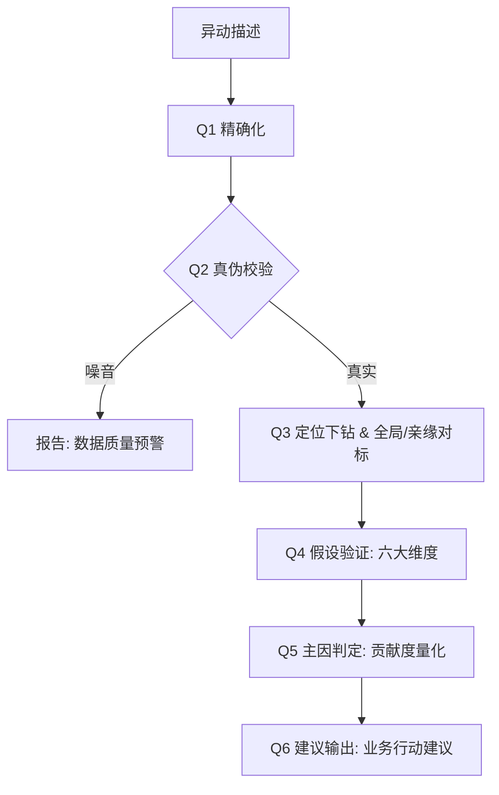

# 洋葱学园异动归因分析框架 v2.0 (SOP v2)

> **核心进化**：从“局部查数”升级为“智能诊断”。引入全局对标、真伪校验、自动化全维度下钻及贡献度量化。

---

## 一、归因分析六问 (The Six Questions)

本框架严格遵循以下逻辑链路，每一步的输出作为下一步的输入：

### Q1: 精确化 (Precision)
- **目标**：定义异常。
- **动作**：提取指标、维度（如：九年级）、时间（本周 vs 基线）、方向、幅度。
- **AI 辅助**：调用 `glossary/` 确认计算口径。

### Q2: 真伪判定 (Authenticity)
- **目标**：过滤噪音。
- **核心逻辑**：
  1. **数据完整性**：检查 Impala 分区是否刷全，记录数是否与均值存在异常方差。
  2. **离群值清洗**：识别并标记 $P_{99}$ 以上的“大单”干扰。
  3. **基线偏移**：检查是否因为去年同期的“活动波峰”导致的虚假下跌。

### Q3: 定位下钻 (Location)
- **目标**：锁定战场。
- **核心逻辑**：
  1. **全局 vs 局部对比**：对比“目标年级”与“全学段大盘”的趋势背离度。
  2. **亲缘维度扫描**：检查是否有其他年级（如：高三）出现了同步波动。
  3. **全维度穷举**：自动遍历 10+ 核心维度，输出贡献度排行榜。

### Q4: 归因验证 (Attribution)
- **目标**：寻找动因。
- **六大假设维度**：流量、用户结构、销售执行、商品策略、外部因素、产品功能。
- **动作**：针对 Q3 锁定的重点维度，执行专项 SQL 验证。

### Q5: 主因判定 (Main Cause)
- **目标**：量化贡献。
- **逻辑**：使用因子分解模型，将总跌幅拆解到各假设因子上。
- **标注**：🔴 主因 (>50%) | 🟡 次因 (20-50%) | ⚪ 排除 (<20%)。

### Q6: 建议输出 (Suggestion)
- **目标**：业务闭环。
- **逻辑**：结合 `business-context/`（校历、大促、改版记录）和 AI 推理，给出“人能听懂、周会能讲”的建议。

---

## 二、流程图

---

## 三、关键计算公式

### 1. 营收三因子分解
$$Δ营收 = Δ流量 \times cvr_{base} \times aov_{base} + flow_{current} \times Δcvr \times aov_{base} + flow_{current} \times cvr_{current} \times Δaov$$

### 2. 指标贡献度 (Contribution Score)
$$Contribution_i = \frac{Impact_i}{\sum |Impact_j|} \times 100\%$$

---

## 四、版本差异 (v1 vs v2)

| 功能 | v1 (Manual) | v2 (AI-SOP) |
| :--- | :--- | :--- |
| **判定逻辑** | 经验猜想为主 | 全局对标 + 亲缘识别 |
| **数据质量** | 无感知 | 强制分区校验 + 离群值标记 |
| **下钻方式** | 人工指定维度 | 全量维度自动扫描 |
| **结论量化** | 描述性为主 | 贡献度百分比排序 |
| **业务深度** | 纯数据 | 结合业务日历与上下文 |

---
*洋葱学园 BI 团队 - 2026-04-16*
